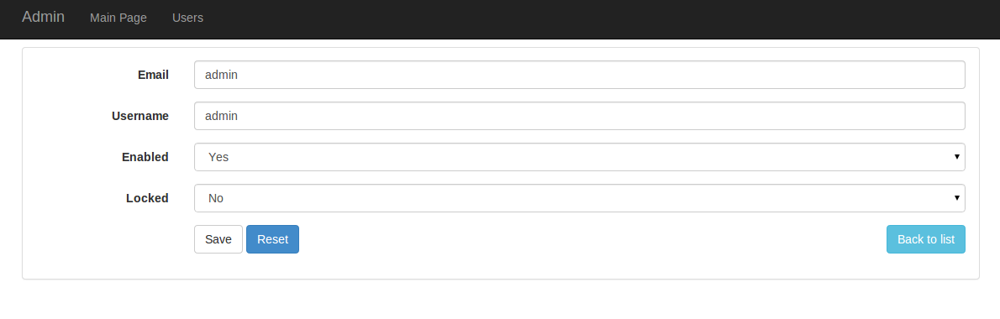

## Admin object class

```php
<?php
// src/FSi/Bundle/DemoBundle/Admin/User

namespace FSi\Bundle\DemoBundle\Admin;

use FSi\Bundle\AdminBundle\Admin\Doctrine\CRUDElement;

class User extends CRUDElement
{
    /**
     * {@inheritdoc}
     */
    public function getClassName()
    {
        return 'FSiDemoBundle:News'; // Doctrine class name
    }

    /**
     * {@inheritdoc}
     */
    public function getId()
    {
        return 'news'; // id is used in url generation http://domain.com/admin/{id}/list
    }

    /**
     * {@inheritdoc}
     */
    public function getName()
    {
        return 'admin.apartment.name'; // names are translated in twig so you can use translation key as name
    }

    /**
     * {@inheritdoc}
     */
    protected function initDataSource(DataSourceFactoryInterface $factory)
    {
        /* @Var $datasource \FSi\Component\DataSource\DataSource */
        $datasource = $factory->createDataSource('doctrine', array(
            'entity' => $this->getClassName()
        ), 'datasource');

        $datasource->addField('email', 'text', 'like');
        $datasource->addField('username', 'text', 'like');

        // Here you can add some fields into datasource
        // To get more information about datasource you should visit https://github.com/fsi-open/datasource

        return $datasource;
    }

    /**
     * {@inheritdoc}
     */
    protected function initDataGrid(DataGridFactoryInterface $factory)
    {
        /* @var $datagrid \FSi\Component\DataGrid\DataGrid */
        $datagrid = $factory->createDataGrid('datagrid');

        $datagrid->addColumn('email', 'text', array(
            'label' => 'Eamil'
        ));
        $datagrid->addColumn('username', 'text', array(
            'label' => 'Username'
        ));
        $datagrid->addColumn('enabled', 'boolean', array(
            'label' => 'Enabled'
        ));
        $datagrid->addColumn('locked', 'boolean', array(
            'label' => 'Locked'
        ));
        $datagrid->addColumn('roles', 'text', array(
            'label' => 'Roles',
            'value_format' => function($data) {
                return implode(', ', $data['roles']);
            }
        ));
        $datagrid->addColumn('action', 'action', array(
            'label' => 'Action',
            'field_mapping' => array('id'),
            'actions' => array(
                'edit' => array(
                    'url_attr' => array(
                        'class' => 'btn btn-warning btn-small-horizontal',
                        'title' => 'edit user'
                    ),
                    'content' => '<span class="icon-eject icon-white"></span>',
                    'route_name' => 'fsi_admin_crud_edit',
                    'parameters_field_mapping' => array(
                        'id' => 'id'
                    ),
                    'additional_parameters' => array(
                        'element' => $this->getId()
                    )
                )
            )
        ));

        // Here you should add some columns into datagrid
        // To get more information about datasource you should visit https://github.com/fsi-open/datagrid

        return $datagrid;
    }

    protected function initCreateForm(FormFactoryInterface $factory)
    {
        $data = new \FSi\Bundle\DemoBundle\Entity\News();
        $builder = $factory->createNamedBuilder('news', 'form', $data);

        $this->buildForm($builder);

        // Here you should add some fields into form
        // To get more information about Symfony form you should visit http://symfony.com/doc/current/book/forms.html

        return $builder->getForm();
    }

    /**
     * {@inheritdoc}
     */
    protected function initEditForm(FormFactoryInterface $factory, $data = null)
    {
        $builder = $factory->createNamedBuilder('news', 'form', $data);

        $this->buildForm($builder);

        // Here you should add some fields into form
        // To get more information about Symfony form you should visit http://symfony.com/doc/current/book/forms.html

        return $builder->getForm();
    }

    /**
     * {@inheritdoc}
     */
    protected function buildForm(FormBuilderInterface $builder)
    {
        $builder->add('email', 'email', array(
        ));
        $builder->add('username', 'text', array(
        ));
        $builder->add('enabled', 'choice', array(
            'choices' => array(
                0 => 'No',
                1 => 'Yes',
            )
        ));
        $builder->add('locked', 'choice', array(
            'choices' => array(
                0 => 'No',
                1 => 'Yes',
            )
        ));
    }
}
```

## User CRUD service

Every single admin element must be registered as a service with ``admin.element`` tag.
Optionally you can also use tag ``alias`` attribute to assign element into group.
Group name as element name is translated so you can use translation key as a group name (alias)

```xml

<?xml version="1.0" ?>

<container xmlns="http://symfony.com/schema/dic/services"
           xmlns:xsi="http://www.w3.org/2001/XMLSchema-instance"
           xsi:schemaLocation="http://symfony.com/schema/dic/services http://symfony.com/schema/dic/services/services-1.0.xsd">
<services>

    <service id="fsi_demo_bundle.admin.news" class="FSi\Bundle\DemoBundle\Admin\News">
        <tag name="admin.element"/>
    </service>

</services>
</container>

```

This should be enough to create simple admin element and display it in menu.
However sometimes you need you customize admin object. This can be done with options that you can pass as a service
collection argument.

## Doctrine CRUD Element options

```xml
<?xml version="1.0" ?>

<container xmlns="http://symfony.com/schema/dic/services"
           xmlns:xsi="http://www.w3.org/2001/XMLSchema-instance"
           xsi:schemaLocation="http://symfony.com/schema/dic/services http://symfony.com/schema/dic/services/services-1.0.xsd">
<services>

    <service id="fsi_demo_bundle.admin.news" class="FSi\Bundle\DemoBundle\Admin\News">
        <argument type="collection">
            <argument key="allow_delete">true</argument>
            <argument key="template_crud_list">@FSiDemo/Admin/news_edit.html.twig</argument>
            <argument key="template_crud_create">@FSiDemo/Admin/news_create.html.twig</argument>
            <argument key="template_crud_edit">@FSiDemo/Admin/news_edit.html.twig</argument>
            <argument key="template_crud_delete">@FSiDemo/Admin/news_create.html.twig</argument>
        </argument>
        <tag name="admin.element"/>
    </service>

</services>
```

## Demo





