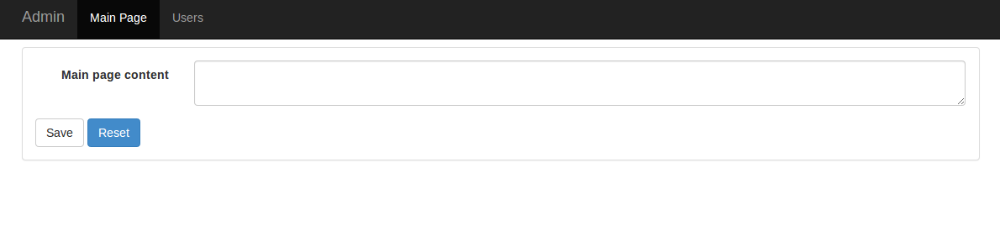

**This element type require to install fsi/resource-repository-bundle before using it.**  
**You can read more about it [here](https://github.com/fsi-open/resource-repository-bundle)**
# Installation

Add to your composer.json following lines

```
"require": {
    "doctrine/doctrine-bundle" : "1.2.*@dev"
    "fsi/resource-repository-bundle" : "1.0.*"
}
```

Update AppKernel.php

```php
public function registerBundles()
{
    $bundles = array(
        new FSi\Bundle\ResourceRepositoryBundle\FSiResourceRepositoryBundle(),
        // Admin Bundle
        new Knp\Bundle\MenuBundle\KnpMenuBundle(),
        new FSi\Bundle\DataSourceBundle\DataSourceBundle(),
        new FSi\Bundle\DataGridBundle\DataGridBundle(),
        new FSi\Bundle\AdminBundle\FSiAdminBundle(),
    );
}
```

Create Resource entity 

```php

<?php

namespace FSi\Bundle\DemoBundle\Entity;

use Doctrine\ORM\Mapping as ORM;
use FSi\Bundle\ResourceRepositoryBundle\Model\Resource as BaseResource;

/**
 * @ORM\Entity(repositoryClass="FSi\Bundle\ResourceRepositoryBundle\Entity\ResourceRepository")
 * @ORM\Table(name="fsi_resource")
 */
class Resource extends BaseResource
{
}
```

Modify app/config/config.yml

```
# app/config/config.yml

fsi_resource_repository:
    resource_class: FSi\Bundle\DemoBundle\Entity\Resource
```

Update database with following console command 

```
$ php app/console doctrine:schema:update --force
```

# Configuration

Lets assume we have following configuration in ``resource_map.yml``

```yml
resources:
    type: group
    main_page:
        type: group
        content:
            type: textarea
            form_options:
                label: Main page content
```

## Admin object class

```php
<?php

namespace FSi\Bundle\DemoBundle\Admin;

use FSi\Bundle\AdminBundle\Doctrine\Admin\ResourceElement;

class MainPage extends ResourceElement
{
    /**
     * {@inheritdoc}
     */
    public function getKey()
    {
        return 'resources.main_page'; // must be a group type key
    }

    /**
     * {@inheritdoc}
     */
    public function getId()
    {
        return 'main_page';
    }

    /**
     * {@inheritdoc}
     */
    public function getName()
    {
        return 'Main Page';
    }

    /**
     * {@inheritdoc}
     */
    public function getClassName()
    {
        return 'FSi\Bundle\DemoBundle\Entity\Resource';
    }
}
```

## Main page resource service

Every single admin element must be registered as a service with ``admin.element`` tag.
Optionally you can also use tag ``alias`` attribute to assign element into group.
Group name as element name is translated so you can use translation key as a group name (alias)

```xml

<?xml version="1.0" ?>

<container xmlns="http://symfony.com/schema/dic/services"
           xmlns:xsi="http://www.w3.org/2001/XMLSchema-instance"
           xsi:schemaLocation="http://symfony.com/schema/dic/services http://symfony.com/schema/dic/services/services-1.0.xsd">
<services>

    <service id="fsi_demo_bundle.admin.main_page" class="FSi\Bundle\DemoBundle\Admin\MainPage">
        <tag name="admin.element"/>
    </service>

</services>
</container>

```

This should be enough to create simple admin element and display it in menu.
However sometimes you need you customize admin object. This can be done with options that you can pass as a service
collection argument.

## Doctrine CRUD Element options

```xml
<?xml version="1.0" ?>

<container xmlns="http://symfony.com/schema/dic/services"
           xmlns:xsi="http://www.w3.org/2001/XMLSchema-instance"
           xsi:schemaLocation="http://symfony.com/schema/dic/services http://symfony.com/schema/dic/services/services-1.0.xsd">
<services>

    <service id="fsi_demo_bundle.admin.news" class="FSi\Bundle\DemoBundle\Admin\MainPage">
        <argument type="collection">
            <argument key="title">resource.title</argument>
            <argument key="template">@FSiDemo/Resource/resource.html.twig</argument>
        </argument>
        <tag name="admin.element"/>
    </service>

</services>
```

